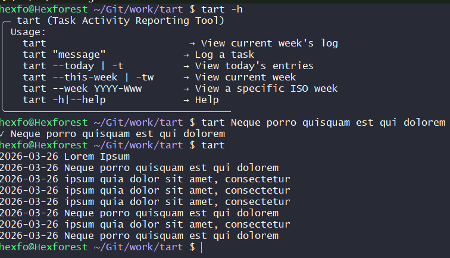

# 🥧 tart

`tart` is a lightweight CLI tool for logging task activity.

It is designed to be fast, simple, and predictable:

* no dependencies
* file-based storage
* human-readable logs
* minimal friction for daily use

---

## Screenshot



---

## What it does

* `tart` → shows the current week's log
* `tart "message"` → appends a task entry for today
* `tart --today` or `tart -t` → shows today's entries
* `tart --this-week` or `tart -tw` → shows current week
* `tart --week YYYY-Www` → shows a specific ISO week

---

## Installation

### Option 1 — Clone repository

```bash
git clone https://github.com/dawidpolakowski/tart.git
cd tart
chmod +x tart.sh
cp tart.sh ~/bin/tart
```

Make sure `~/bin` is in your PATH:

```bash
export PATH="$HOME/bin:$PATH"
```

---

### Option 2 — One-line install (recommended)

```bash
curl -sL https://raw.githubusercontent.com/dawidpolakowski/tart/main/tart.sh -o /usr/local/bin/tart && chmod +x /usr/local/bin/tart
```

---

## Usage

Show current week:

```bash
tart
```

Add a new entry:

```bash
tart "implemented login feature"
```

Show today's entries:

```bash
tart --today
# or
tart -t
```

Show current week explicitly:

```bash
tart --this-week
# or
tart -tw
```

Show a specific week:

```bash
tart --week 2026-W13
```

---

## Data storage

Default location:

```bash
~/Documents/tart
```

Override with environment variable:

```bash
export TART_LOGDIR="$HOME/somewhere/tart"
```

File format:

```bash
YYYY-Www.log
```

Entry format:

```bash
YYYY-MM-DD <message>
```

---

## Example

```bash
2026-03-23 implemented login feature
2026-03-24 fixed auth bug
2026-03-24 reviewed API changes
```

---

## Philosophy

`tart` tracks what you did, not how long it took.

It is a small tool designed to stay out of your way and make logging and reviewing work effortless.
