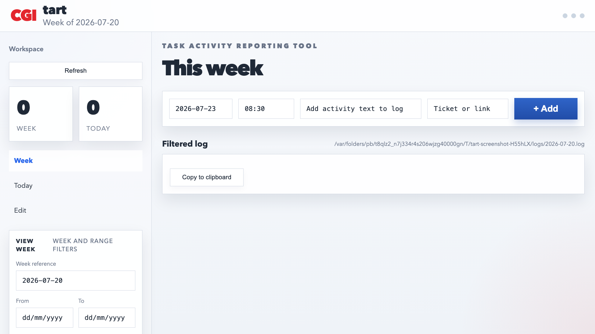

# tart

`tart` is a lightweight command-line tool for logging task activity.

It is open source under the MIT License.

It keeps the daily workflow fast, while presenting a more predictable CLI surface:

* command-based interface
* backwards-compatible quick logging
* file-based storage
* human-readable weekly logs
* strict date and ISO week validation
* configurable log directory

## Desktop App Screenshot



The image above shows the Electron desktop app that ships with `tart`.
It gives you the same weekly activity workflow as the CLI, plus tray/menu-bar access, editing, and export actions.

The desktop UI is also covered by automated renderer and core tests, so the screenshot stays in step with the app structure.

## Installation

### Linux

```bash
curl -fsSL https://github.com/dawidpolakowski/tart/releases/latest/download/install.sh | bash
```

### macOS

```bash
curl -fsSL https://github.com/dawidpolakowski/tart/releases/latest/download/install-macos.sh | bash
```

The macOS installer puts the CLI in:

```text
~/.local/bin/tart
```

It also installs the desktop app in:

```text
~/Applications/tart.app
```

The desktop app files live in:

```text
~/Library/Application Support/tart
```

The desktop app needs Node.js and npm so the installer can install Electron dependencies. The CLI works without Node.js.

Install from a local clone:

```bash
git clone https://github.com/dawidpolakowski/tart.git
cd tart
./scripts/install-macos.sh
```

Choose another CLI install directory:

```bash
TART_INSTALL_DIR="$HOME/bin" ./scripts/install-macos.sh
```

Choose another desktop app directory:

```bash
TART_MACOS_APP_DIR="$HOME/Desktop" ./scripts/install-macos.sh
```

### Linux Details

The shell installer puts `tart` in:

```text
~/.local/bin/tart
```

If `~/.local/bin` is not already in your `PATH`, the installer prints the exact line to add to your shell profile.

Install from a local clone:

```bash
git clone https://github.com/dawidpolakowski/tart.git
cd tart
./scripts/install.sh
```

Choose another install directory:

```bash
TART_INSTALL_DIR="$HOME/bin" ./scripts/install.sh
```

### Windows

Install Git for Windows first, because `tart` runs through Git Bash on Windows.

Then run this in PowerShell:

```powershell
irm https://github.com/dawidpolakowski/tart/releases/latest/download/install.ps1 | iex
```

The installer puts `tart` in:

```text
%LOCALAPPDATA%\tart\bin
```

It also adds that directory to your user `PATH`. Open a new terminal after installation, then run:

```powershell
tart version
```

Install from a local clone:

```powershell
git clone https://github.com/dawidpolakowski/tart.git
cd tart
powershell -ExecutionPolicy Bypass -File .\scripts\install.ps1
```

### Release Downloads

Latest release assets:

* [Shell installer](https://github.com/dawidpolakowski/tart/releases/latest/download/install.sh)
* [macOS installer](https://github.com/dawidpolakowski/tart/releases/latest/download/install-macos.sh)
* [PowerShell installer](https://github.com/dawidpolakowski/tart/releases/latest/download/install.ps1)
* [Linux archive](https://github.com/dawidpolakowski/tart/releases/latest/download/tart-linux.tar.gz)
* [macOS archive](https://github.com/dawidpolakowski/tart/releases/latest/download/tart-macos.tar.gz)
* [Windows archive](https://github.com/dawidpolakowski/tart/releases/latest/download/tart-windows.zip)

The release archives include the CLI, the Electron desktop app source, installer scripts, and launcher assets.

## Project Base

Create a new Electron desktop project scaffold based on `tart`:

```bash
./scripts/create-project-base.sh "Focus Journal"
```

By default, the generator writes to `./focus-journal`. You can also choose the output directory explicitly:

```bash
./scripts/create-project-base.sh "Client Notes" /tmp/client-notes
```

Project names may include letters, numbers, spaces, dots, underscores, and hyphens.

The generated base includes:

* Electron main, preload, renderer, HTML, and CSS files
* tray or menu-bar behavior
* a weekly file-backed activity store under `~/Documents/<project-slug>`
* starter icons copied from this repo
* a minimal `package.json`, `.gitignore`, and README
* `electron` as the only starter dev dependency

After generation:

```bash
cd focus-journal
npm install
npm run desktop
```

You can also use the generated `README.md` inside the scaffold as a quick checklist for the first customization steps.

## Usage

Show the current week's log:

```bash
tart
tart list
```

Add a task entry:

```bash
tart add "implemented login feature"
```

Quick logging is still supported:

```bash
tart "implemented login feature"
```

Show today's entries:

```bash
tart today
tart --today
```

Show a specific week:

```bash
tart week 2026-04-30
tart list --week 2026-W18
```

Print the resolved log path:

```bash
tart path
tart path 2026-W18
```

Show configuration:

```bash
tart config
```

## Desktop Launcher

Install desktop dependencies:

```bash
npm install
```

Run the Electron desktop app:

```bash
npm run desktop
# or
./tart-desktop
```

The desktop app provides:

```text
Add entry
Optional ticket or link reference
This week
Today
Raw weekly editor
Export week as TXT, CSV, or PDF
Open log directory
```

Notes:

* it uses the same file format as the CLI
* it reads `TART_LOGDIR` when set
* it stores logs in `~/Documents/tart` by default
* it keeps a tray or menu bar icon active, and minimize or close hides the window there
* use the tray menu to show the app, open the log directory, or quit
* it requires Node.js and Electron dependencies installed with `npm install`

## Desktop Testing

The repository includes automated coverage for the desktop app:

* `tests/test_desktop_core.mjs` checks the app core data model and weekly log behavior
* `tests/test_desktop_renderer.mjs` checks renderer interactions and UI state updates
* `tests/run.sh` runs the desktop smoke checks, including the scaffold generator and desktop asset checks

If you update the desktop UI or the screenshot, run the test suite and refresh `src/Screenshot.png` so the README matches the current app.

Regenerate native desktop icons from the cake-clock source image:

```bash
npm run icons
```

## Commands

```text
tart add <message...>             Add a task entry for today
tart list [--week <ref>]          Show entries for a week
tart today                        Show today's entries
tart week [<ref>]                 Show entries for the week containing <ref>
tart path [<ref>]                 Print the log file path for a week
tart init                         Create the log directory
tart config                       Show resolved configuration
tart version                      Show version
tart help                         Show help
```

Legacy aliases are still available:

```text
tart -t | --today
tart -tw | --this-week
tart --week <ref>
```

## Week References

Week commands accept either:

```text
YYYY-MM-DD
YYYY-Www
```

Date references can be any date in the target week. `tart` resolves them to the Monday log file for that ISO week.

Examples:

```bash
tart week 2026-04-30
tart week 2026-W18
```

Both resolve to:

```text
2026-04-27.log
```

## Configuration

Default log directory:

```bash
~/Documents/tart
```

Override it for your shell:

```bash
export TART_LOGDIR="$HOME/somewhere/tart"
```

Override it for one command:

```bash
tart --log-dir "$HOME/tmp/tart" add "tested release candidate"
```

## Data Format

Each week is stored in its own file, named after the Monday of that week:

```text
2026-04-27.log
```

Entries are plain text:

```text
YYYY-MM-DD <message>
```

Example:

```text
2026-04-27 implemented login feature
2026-04-28 fixed auth bug
2026-04-30 reviewed API changes
```

## Development

Run the test suite:

```bash
npm test
```

The tests include Bash CLI regression tests and Node tests for the Electron desktop core. They use isolated temporary log directories and pin the current date with `TART_TODAY`.

## Philosophy

`tart` tracks what you did, not how long it took.

It is intentionally small, dependency-free, and easy to inspect, but the command surface is structured enough to feel reliable in day-to-day professional use.
